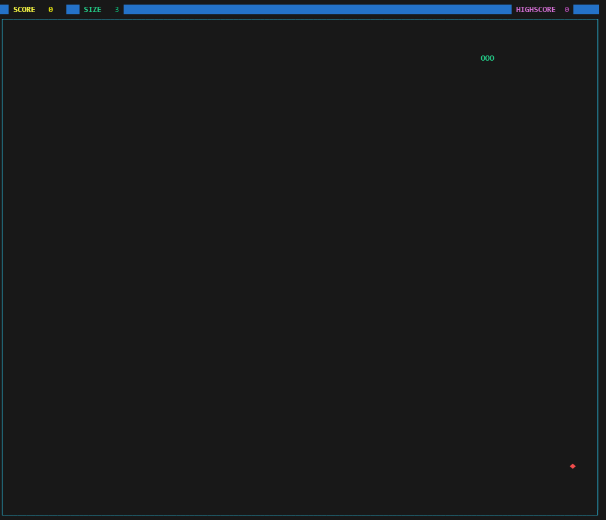

# Terminal Snake 🐍
 
The old and good Snake game now available to play in Terminal with a modern interface!
 
[](https://marquesm91.github.io/TerminalSnake/)
[](https://terminalsnake-leaderboard.web.app/wasm.html)
[](https://terminalsnake-leaderboard.web.app/wasm.html)
[](https://opensource.org/licenses/MIT)
 

 
## ✨ Features
 
- **Modern Interface**: Colorful UI with status bar, styled borders, and game over screen
- **Menu System**: Navigate through main menu, settings, and difficulty options
- **Highscore System**: Persistent highscore saved locally
- **Multiple Difficulty Levels**: Easy, Normal, Hard, and Insane modes
- **Smooth Gameplay**: Optimized timing for fluid snake movement
- **🌐 World Leaderboard**: Compete globally with Firebase-powered leaderboard
- **🔐 Social Login**: Sign in with Google, GitHub, or Twitter (Web)
- **🏆 Gamification**: Earn badges, complete weekly challenges, and track stats
- **📢 Social Sharing**: Share your score and earn bonus points
- **🛡️ Anti-Cheat System**: Replay-based validation with deterministic PRNG
- **🏗️ Clean Architecture**: DDD/Hexagonal architecture for maintainability
- **🕹️ WebAssembly Build**: Play directly in your browser (no installation needed!)
- **📱 PWA Support**: Install on your phone as a native app

## 📋 Prerequisites

This game was coded using [NCurses](https://github.com/gittup/ncurses), a library to ease the development of Console Applications. You can create game windows or print any character anywhere with just a few lines of code.

### Installing Dependencies

**Ubuntu/Debian:**
```bash
sudo apt-get install libncurses5-dev libcurl4-openssl-dev libssl-dev
```

**Fedora/RHEL:**
```bash
sudo dnf install ncurses-devel libcurl-devel openssl-devel
```

**macOS:**
```bash
brew install ncurses curl openssl
```

All the tests were coded using [Catch](https://github.com/philsquared/Catch), a powerful framework for unit-tests that is header-only! You will find `catch.hpp` in the `tests` folder.

## 🚀 Build and Play

```bash
git clone https://github.com/marquesm91/TerminalSnake
cd TerminalSnake
make            # Build all 3 versions
make run        # Run v3.0 (Clean Architecture)
```

### Version Switching

The project maintains 3 versions for backward compatibility:

| Command | Version | Description | Binary |
|---------|---------|-------------|--------|
| `make legacy` | v1.0 | Original monolithic code | `bin/tsnake` |
| `make modular` | v2.0 | Platform abstraction layer | `bin/tsnake_modular` |
| `make clean_arch` | v3.0 | Clean Architecture (DDD) | `bin/tsnake_clean` |

**Quick run commands:**
```bash
make run-legacy    # Run v1.0
make run-modular   # Run v2.0
make run-clean     # Run v3.0 (default)
```

**Show all options:**
```bash
make help
```

### Adding as Terminal Command

```bash
echo 'alias tsnake="~/TerminalSnake/bin/tsnake_clean"' >> ~/.bash_aliases
source ~/.bashrc
```

## 🎮 Game Controls

| Key | Action |
|-----|--------|
| ↑ | Move Up |
| ↓ | Move Down |
| ← | Move Left |
| → | Move Right |
| Y/Enter | Confirm (Play again) |
| N | Decline (Exit) |
| Q | Quit/Back |

## 🏗️ Architecture

The game follows **Clean Architecture** (DDD/Hexagonal) principles:

```
src/                           # Clean Architecture (v3.0)
├── domain/                    # Business rules (zero dependencies)
│   ├── entities/              # Snake, Food, Game aggregate
│   ├── value_objects/         # Point, Direction, GameConfig
│   └── services/              # RandomService, ReplayService
├── application/               # Use cases and port interfaces
│   ├── ports/                 # IRenderer, IInput, IStorage...
│   └── use_cases/             # PlayGameUseCase, SubmitScoreUseCase
└── infrastructure/            # Concrete implementations
    ├── adapters/              # NCursesRenderer, NCursesInput
    └── persistence/           # FileStorage

libs/                          # Legacy code (v1.0, v2.0)
├── *.hpp                      # Original classes
├── core/                      # Modular engine (v2.0)
└── platform/                  # Platform adapters (v2.0)

tests/
├── testPoint.cpp              # Legacy tests (22 cases)
└── testCleanArch.cpp          # Clean Architecture tests (74 cases)
```

### Core Domain

| Class | Description |
|-------|-------------|
| `Point` | Immutable 2D coordinate value object |
| `Direction` | Movement direction enum with utilities |
| `GameConfig` | Immutable game configuration (Builder pattern) |
| `SnakeEntity` | Snake body management with fixed-size array |
| `FoodEntity` | Food position and state |
| `Game` | Aggregate root coordinating Snake + Food |
| `RandomService` | Deterministic PRNG (xorshift32) for replay |
| `ReplayService` | Records and validates game replays |

### Ports (Interfaces)

| Port | Description |
|------|-------------|
| `IRenderer` | Output rendering abstraction |
| `IInput` | User input abstraction |
| `ITimer` | Time management abstraction |
| `IStorage` | Local persistence abstraction |
| `IAuth` | Authentication abstraction |
| `ILeaderboard` | Remote leaderboard abstraction |

### Game Flow

1. **Initialization**: NCurses setup, color pairs, menu display
2. **Menu Loop**: User selects Start Game, Settings, or Exit
3. **Game Loop**:
   - Read keyboard input
   - Validate direction change
   - Calculate new head position
   - Check collisions (wall, self)
   - Update snake position
   - Check food consumption
   - Render frame
4. **Game Over**: Display score, check highscore, prompt replay

## 🧪 Testing & Code Quality

### Running Tests

```bash
make test              # Run all tests
cd tests && make test  # Same, from tests directory
```

**Test results:**
- Legacy tests: 22 test cases, 60 assertions
- Clean Architecture tests: 74 test cases, 5,431 assertions

### Code Coverage

Generate HTML coverage report (requires `lcov`):

```bash
# Install lcov if needed
sudo apt install lcov

# Generate report
cd tests && make coverage

# Open report
xdg-open coverage_report/html/index.html
```

### Lines of Code

```bash
# Install cloc if needed
sudo apt install cloc

# Show statistics
make loc
make stats
```

**Project Statistics:**
| Layer | Files | Code Lines |
|-------|-------|------------|
| Clean Architecture (`src/`) | 21 | 1,713 |
| Full Project | 54 | 6,228 |

## 📦 Releases

| Version | Description |
|---------|-------------|
| **v3.1** | 🕹️ WebAssembly build - Play in browser via Firebase Hosting |
| **v3.0** | 🏗️ Clean Architecture refactor (DDD/Hexagonal), 74+ test cases |
| **v2.0** | 🌐 World Leaderboard with Firebase, Google Sign-In, Anti-Cheat system |
| v1.4 | Snake now grows when eating food, size display updates correctly |
| v1.3 | Added menu system, settings, highscore persistence, modern UI |
| v1.2a | Fix bug when pressing two arrow keys rapidly |
| v1.2 | Introduced GAME OVER screen and play again prompt |
| v1.1a | Fix bug where size and score aren't printing correctly |
| v1.1 | Code refactored. Introduced Clock, Board, Game and Common |
| v1.0e | Add difference between UP/DOWN and RIGHT/LEFT delay |
| v1.0d | Introduced Clock for timestamp-based movement control |
| v1.0c | Fix bug where food spawns inside snake |
| v1.0b | Improved game design architecture |
| v1.0a | Introduced unit tests using Catch |
| v1.0 | First version of the game |

## 🗺️ Roadmap

- [x] Create highscore functionality
- [x] Menu system for game settings
- [x] Difficulty levels
- [x] World leaderboard with Firebase
- [x] Google authentication
- [x] Anti-cheat system with replay validation
- [x] Clean Architecture refactor
- [x] GitHub Pages landing page
- [x] WebAssembly build (play in browser)
- [x] Firebase Hosting with auto-deploy
- [x] PWA Support (Manifest & Icons)
- [ ] Gamification System (Badges, Weekly Challenges)
- [ ] Social Login (GitHub, Twitter) & Sharing Bonuses
- [ ] Deploy Firebase Cloud Functions (backend ready)
- [ ] Implement Firebase adapters for Clean Architecture
- [ ] Arduino platform support
- [ ] Multiple game modes (walls, obstacles)
- [ ] Sound effects
- [ ] Multiplayer support

## 🌐 World Leaderboard (WIP)

The leaderboard system uses Firebase with server-side replay validation:

### Implementation Status

| Component | Status | Location |
|-----------|--------|----------|
| Firebase Cloud Functions | ✅ Ready | `firebase/functions/index.js` |
| Legacy Auth/Leaderboard | ✅ Ready | `libs/auth.hpp`, `libs/leaderboard.hpp` |
| Clean Arch Ports | ✅ Defined | `src/application/ports/` |
| Clean Arch Adapters | ⏳ TODO | Need `FirebaseAuthAdapter`, `FirebaseLeaderboardAdapter` |
| Firebase Deployment | ⏳ TODO | Requires `firebase deploy` |

### Anti-Cheat System

The game uses deterministic PRNG (xorshift32) for replay validation:

```
┌─────────────────┐     ┌─────────────────┐     ┌─────────────────┐
│     Client      │     │    Firebase     │     │ Cloud Function  │
│                 │     │                 │     │                 │
│ 1. Play game    │     │                 │     │                 │
│ 2. Record replay│     │                 │     │                 │
│ 3. Send Base64  │────▶│ 4. Store        │────▶│ 5. Re-simulate  │
│                 │     │                 │     │ 6. Compare score│
│                 │     │ 8. Valid score  │◀────│ 7. Validate/Reject│
└─────────────────┘     └─────────────────┘     └─────────────────┘
```

### Firebase Setup

1. Create Firebase project at [console.firebase.google.com](https://console.firebase.google.com)
2. Enable Firestore and Authentication (Google provider)
3. Update `libs/firebase_config.hpp` with your credentials
4. Deploy functions:
   ```bash
   cd firebase/functions
   npm install
   firebase deploy --only functions
   ```

## 📦 Installation

### Quick Download

Download pre-built binaries from [GitHub Releases](https://github.com/marquesm91/TerminalSnake/releases/latest):

| Platform | Architecture | Download |
|----------|--------------|----------|
| Linux | x64 | `tsnake-linux-x64.tar.gz` |
| Linux | ARM64 | `tsnake-linux-arm64.tar.gz` |
| macOS | Apple Silicon | `tsnake-macos-arm64.zip` |
| macOS | Intel | `tsnake-macos-x64.zip` |
| Windows | x64 | `tsnake-windows-x64.zip` |

### Package Managers

```bash
# Homebrew (macOS/Linux)
brew install marquesm91/tap/tsnake

# Snap (Ubuntu/Linux)
snap install tsnake

# AUR (Arch Linux)
yay -S tsnake

# Winget (Windows)
winget install marquesm91.tsnake

# Chocolatey (Windows)
choco install tsnake
```

## 🔧 Technical Details

### Dependencies

| Library | Purpose | Install |
|---------|---------|---------|
| NCurses | Terminal UI | `apt install libncurses5-dev` |
| libcurl | HTTP requests | `apt install libcurl4-openssl-dev` |
| OpenSSL | HTTPS/crypto | `apt install libssl-dev` |
| Catch | Testing | Header-only (included) |
| lcov | Coverage | `apt install lcov` (optional) |
| cloc | LOC stats | `apt install cloc` (optional) |

### Build Flags

```makefile
CFLAGS = -std=c++11 -Wall -Wextra -Wpedantic
LIBS   = -lncurses -lcurl -lssl -lcrypto
```

### Directory Structure

```
TerminalSnake/
├── main.cpp              # v1.0 entry point
├── main_modular.cpp      # v2.0 entry point
├── Makefile              # Build system
├── libs/                 # Legacy code (v1.0, v2.0)
│   ├── *.hpp             # Original classes
│   ├── core/             # v2.0 engine
│   └── platform/         # v2.0 platform adapters
├── src/                  # v3.0 Clean Architecture
│   ├── domain/           # Business rules
│   ├── application/      # Use cases & ports
│   └── infrastructure/   # Adapters
├── firebase/             # Backend
│   └── functions/        # Cloud Functions
├── tests/                # Test suite
├── docs/                 # GitHub Pages
├── .github/workflows/    # CI/CD
│   ├── release.yml       # Multi-platform builds
│   └── publish.yml       # Package manager publishing
└── bin/                  # Compiled binaries
```

## 🔄 CI/CD Pipeline

The project uses GitHub Actions for automated releases:

1. **On tag push** (`v*`):
   - Builds for Linux (x64, ARM64), macOS (Intel, Apple Silicon), Windows
   - Creates GitHub Release with binaries and checksums

2. **On release publish**:
   - Generates Homebrew formula
   - Builds and publishes to Snap Store
   - Creates Flatpak manifest
   - Generates AUR PKGBUILD
   - Creates Winget/Chocolatey manifests

```bash
# Create a new release
git tag v1.0.0
git push origin --tags
```

## 🌐 GitHub Pages

Visit the landing page: [https://marquesm91.github.io/TerminalSnake/](https://marquesm91.github.io/TerminalSnake/)

Features:
- Live leaderboard (top 10 weekly players)
- Download links for all platforms
- Package manager installation commands

## 🕹️ WebAssembly (Browser) Build

Play the game directly in your browser without any installation!

**Live Demo:** [https://terminalsnake-leaderboard.web.app/wasm.html](https://terminalsnake-leaderboard.web.app/wasm.html)

### Building the WASM Version

The WASM build uses [Emscripten](https://emscripten.org/) to compile C++ to WebAssembly and [xterm.js](https://xtermjs.org/) for terminal emulation in the browser.

**Prerequisites:**
```bash
# Install Emscripten SDK
cd TerminalSnake
git clone https://github.com/emscripten-core/emsdk.git
cd emsdk
./emsdk install latest
./emsdk activate latest
source ./emsdk_env.sh
```

**Build:**
```bash
cd web
make
```

**Output Files:**
- `firebase/public/tsnake.js` - Emscripten JavaScript glue code
- `firebase/public/tsnake.wasm` - WebAssembly binary (~13KB)

### Technical Architecture

```
┌─────────────────────────────────────────────────────────────────┐
│                         Browser                                  │
├─────────────────────────────────────────────────────────────────┤
│  wasm.html                                                       │
│  ├── xterm.js (Terminal Emulator)                               │
│  ├── tsnake.js (Emscripten Glue)                               │
│  └── tsnake.wasm (Game Logic)                                   │
├─────────────────────────────────────────────────────────────────┤
│  JavaScript ↔ WASM Bridge                                        │
│  ├── window.terminalClear()    → js_clear() in C++              │
│  ├── window.terminalWrite(y,x) → js_mvprintw() in C++           │
│  ├── window.terminalRefresh()  → js_refresh() in C++            │
│  └── window.getKey()           → js_getch() in C++              │
└─────────────────────────────────────────────────────────────────┘
```

### WASM-Specific Code

The WASM version (`web/main_web.cpp`) is a self-contained implementation that:
- Uses simple C arrays instead of `std::list` for better WASM compatibility
- Communicates with JavaScript via `EM_JS` macros
- Exports functions: `startGame()`, `runGameLoop()`, `handleKey()`
- Runs at 60fps with level-based speed adjustment

### Firebase Hosting

The WASM build is hosted on Firebase Hosting with proper headers:
```json
{
  "headers": [
    {
      "source": "**/*.wasm",
      "headers": [{"key": "Content-Type", "value": "application/wasm"}]
    },
    {
      "source": "**",
      "headers": [
        {"key": "Cross-Origin-Opener-Policy", "value": "same-origin"},
        {"key": "Cross-Origin-Embedder-Policy", "value": "require-corp"}
      ]
    }
  ]
}
```

### Continuous Deployment

The WASM build is automatically deployed via GitHub Actions (`.github/workflows/wasm.yml`):
1. **Build**: Installs Emscripten, compiles C++ to WASM
2. **Deploy**: Uploads to Firebase Hosting

## 📄 License

This project is licensed under the MIT License - see the [LICENSE.md](LICENSE.md) file for details.

## 🤝 Contributing

Contributions are welcome! Feel free to submit issues and pull requests.